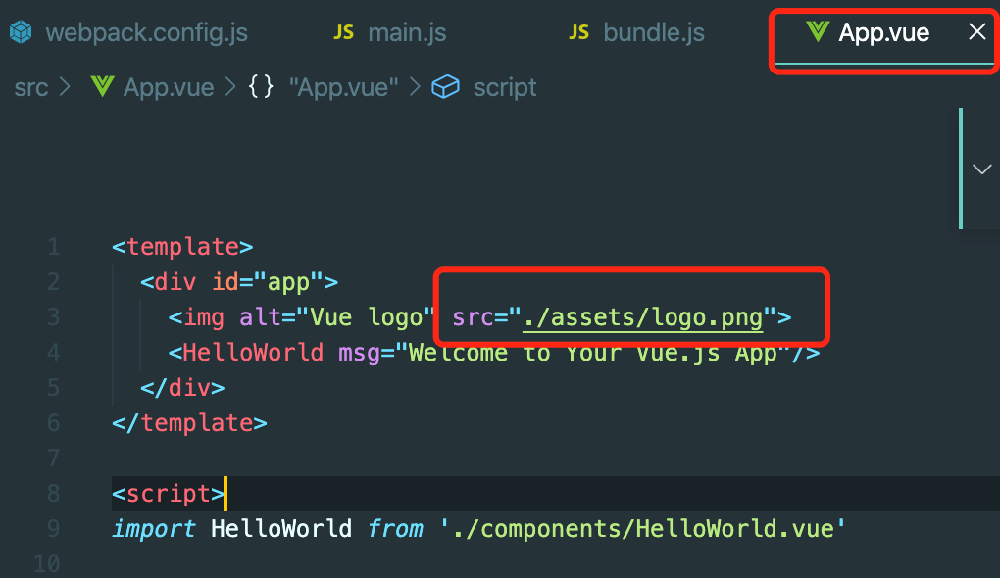

# 常见web问题
- vue中的App.vue组件中 ‘img src="./assets/logo.png"/’在前台页面中的路径下显示 src=[esmodule object]?
  
  - 原因是配置 file-loader 的时候，options 中的esModule:false 就可以了。
  
  
  
  ```js
  //webpack.base.js
   {
                  test: /\.(png|jpe?g|gif)$/i,
                  use: [
                      {
                          loader: 'file-loader',
                          options: {
                              esModule: false
                          }
                      }
                  ]
              },
  ```

原理分析：打包后，可以查找build.js中关于这个图片的模块，会发现它被包裹在一个模块中，这个模块导出的是module.exports=“export default  xxxxxx” 所以最后会是一个对象。

要改成一个相对路径的形式，把 ./ 去掉，那么它的意思就是一个纯的字符串，同时要考虑这个网站根目录的相对路径，而不是开发中的相对目录。

